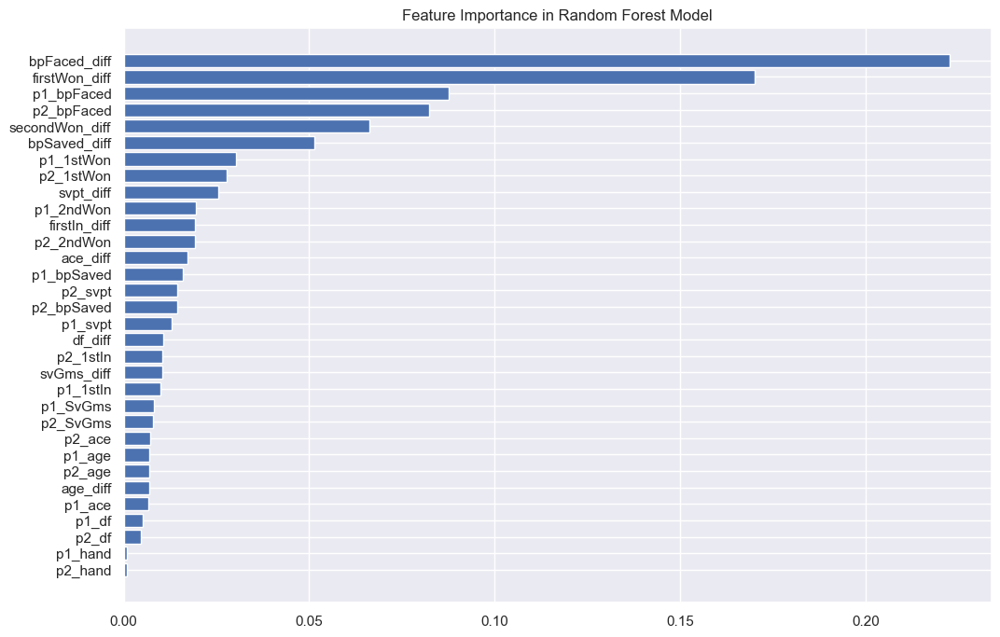
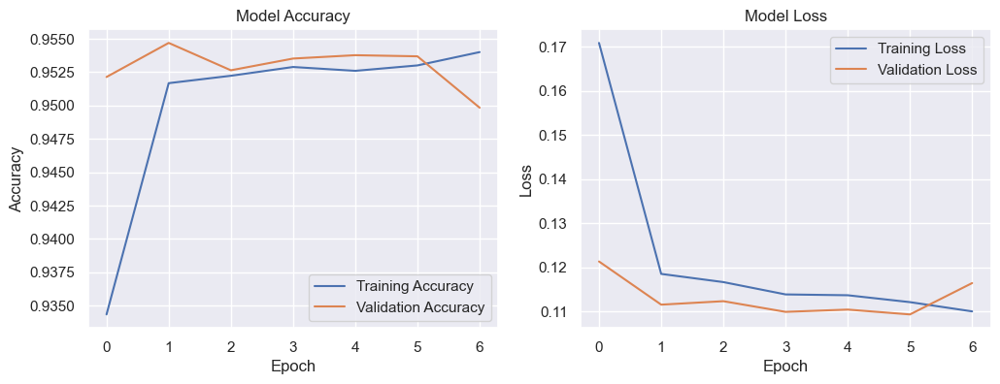

# Welcome to Tennis Match Predictor

## About
_This is a Final Project for MA0218 (Introduction to Data Science and Artificial Intelligence) AY 24/25 Semester 1_

## Contributors

1. Theodore Amadeo Argasetya Atmadja (@theodore_amadeo) - Data Cleaning, GitHub Setters, Evaluation, and Machine Learning
2. Askana Mirza Maulana Irfany - Presentation Slides, Machine Learning, and Data Extraction
3. Timothy Louis Barus - Data Visualization, Exploratory Data Analysis, and Machine Learning
4. Antonius Ivan Setiawan Rahardja - Data Visualization and Machine Learning

## Table of Contents

1. [Problem Introduction](#section-1)
2. [Exploratory Data Analysis (EDA)](#section-2)
3. [Methodology](#section-3)
4. [Evaluation of the Predictions and Conclusion](#section-4)

## Problem Introduction

In professional tennis, predicting match outcomes can provide valuable insights for players, coaches, and sports analysts. However, the influence of different performance metrics—such as serve success, age, and ranking—on match results is complex and not fully understood. This dataset offers a comprehensive view of these variables across numerous matches, presenting an opportunity to identify patterns that determine a player’s likelihood of winning.

#### Key Features :

1. **surface**: Each surface will effect the movement of the ball, which may affect the match result
2. **tourney_level**: Each tournament has their own prestigious, which give pressure to the player
3. **winner_seed** and **loser_seed**: Higher rank player will have higher seed in the bracket
4. **winner_hand** and **loser_hand**: Dominant hand used can be effect the characteristics of tennis stroke
5. **score**: The result of the match
6. **best_of**: Tournament usually use best-of-3, except for master and grand slams
7. **minutes**: The duration of match will effect the level of fatigue
8. **all of the statistics** : Every statistic will determine the player's ability in a match

#### Questions and Objectives

1. What player statistics and match conditions are the most significant predictors of match outcomes in tennis?
2. How can advanced statistical methods, such as machine learning algorithms and the Glicko-2 rating system, improve prediction accuracy compared to traditional models?
3. Can the model be adapted to provide predictions for different types of tournaments and surfaces, considering their unique characteristics?

## Exploratory Data Analysis and Data Visualization

Here is one of the data visualizations that show you the top 5 features that determine the tennis match outcome (after cleaning). For further analysis, you may open the NoteBook to find out some interesting features.

## Methodology (Models)

We will use various Machine Learning Techniques to determine which one is the best predictor, such as:

1. Random Forest
2. Logistic Regression
3. XGBoost
4. Neural Network (**Best One**)

## Evaluation and Conlusion

After running the machine learning system, we can conclude that our hyphotesis as stated before is correct. There are five aspects that always been the top 5 features importance for all of the modes. Table below will explain the top 5 features importance to win a tennis match.
- **Features Importance**
| No. | Feature Importance | Reason |
|-----|-------------------|---------|
| 1. | Break Point Faced | A critical metric **indicating the pressure a player faces during a match**. Reflects how well a player handles high-pressure situations. |
| 2. | Break Point Saved | **Represents the player's defensive capability to turn around challenging scenarios**. Key to maintaining momentum. |
| 3. | First-Serve Point Won | **Indicates the player's ability to capitalize on their first serve**, crucial for dictating match tempo. |
| 4. | Second-Serve Point Won | **Measures performance under pressure, especially when the first serve fails**. Highlights resilience and adaptability. |
| 5. | Serve Point | **A composite measure of the player's effectiveness during their own service games**. Reflects overall control and dominance on serve. |

Based on this table, the coach should focus on improving the player’s resilience in high-pressure situations, especially around break points. Emphasis should be placed on strategies to reduce the frequency of Break Points Faced and enhance the player's ability to save break points, as these metrics reflect the player’s ability to manage stressful moments and maintain momentum. Additionally, the coach should work on increasing the player's effectiveness on first and second serves to maximize First-Serve Point Won and Second-Serve Point Won, which are critical for controlling the match tempo and adaptability under pressure. Focusing on improving the overall Serve Point metric will also be crucial, as it reflects the player's dominance and control in their service games, which is essential for sustaining performance throughout matches.
